# Physics-Informed Multi-Agent Reinforcement Learning for Distributed Multi-Robot Problems

This repository contains all the supplementary material 
associated to the paper with title ["Physics-Informed Multi-Agent 
Reinforcement Learning for Distributed Multi-Robot Problems"](http://arxiv.org/abs/2401.00212). 
Please check out our project website for more details: https://eduardosebastianrodriguez.github.io/phMARL/.

## Dependencies

Our code is tested with ````Ubuntu 18.04```` and ````Python 3.8````. It depends on the following Python packages: 

```gym 0.26.2```

```vmas 1.2.6```

```torch 1.13.1``` 

```numpy 1.24.0``` 

```scipy 1.10.1```

```matplotlib 3.7.0```

```tqdm 4.64.1```

```typing 3.7.4.3```

```pandas 1.5.3```

```Pillow 9.4.0```

```joblib 1.3.2```

```PyQt5 5.15.9```

The paper includes experiments using the [Multi-Agent MuJoCo platform](https://robotics.farama.org/envs/MaMuJoCo/). The code to replicate the results associated to those experiments adapts the [repository](https://github.com/cyanrain7/TRPO-in-MARL/tree/master) of the paper "[Trust Region Policy Optimisation in Multi-Agent Reinforcement Learning](https://arxiv.org/pdf/2109.11251)", and it can be found in the ```mamujoco``` folder. The requirements for running this part of the code can be found in the folder. For further instructions on how to install [Multi-Agent MuJoCo platform](https://robotics.farama.org/envs/MaMuJoCo/), see [https://github.com/openai/mujoco-py](https://github.com/openai/mujoco-py) and [https://github.com/schroederdewitt/multiagent_mujoco](https://github.com/schroederdewitt/multiagent_mujoco).

## Some qualitative results

We propose a novel MARL approach to learn distributed-by-design control policies for general cooperative/competitive multi-robot tasks. 
The solution has three key characteristics: (1) we use a port-Hamiltonian description of the multi-robot system and task that respects the network
topology and robot energy conservation laws, leading to a scalable and sampling efficient parameterization
of the control policy; (2) we parameterize the control policy using self-attention neural networks that handle the time-varying
information available at each robot, so we are able to learn the task while achieving invariance with respect to the number of
robots in the multi-robot team; and (3) we propose modifications over a soft actor-critic to overcome non-stationarity issues while 
allowing robots to interact with other members of the team, and also avoid value factorization/approximations.

In the following we show some qualitative results from six cooperative/competitive scenarios. They cover a wide variety of cooperative and competitive behaviors such as collision avoidance, navigation, transport, evasion and monitoring.
All the policies are trained with 4 robots.

### Reverse transport

|                     4 robots                      |                    8 robots                     |                    12 robots                    |                      16 robots                       |
|:-------------------------------------------------:|:-----------------------------------------------:|:-----------------------------------------------:|:----------------------------------------------------:|
| 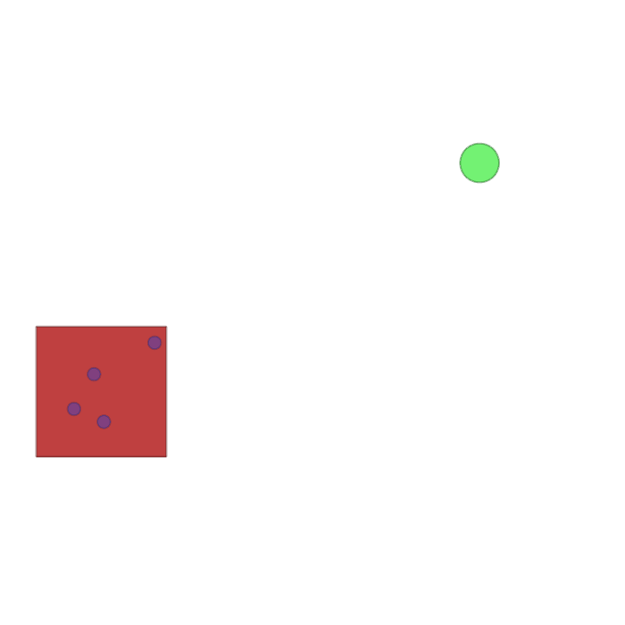 | 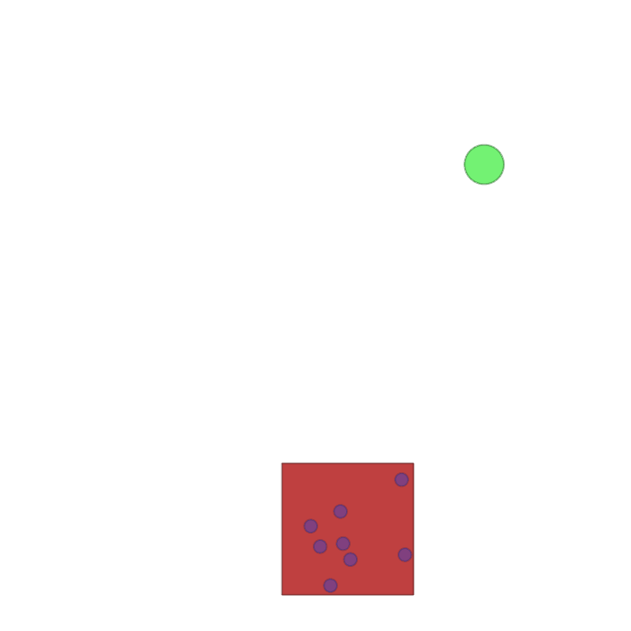 | 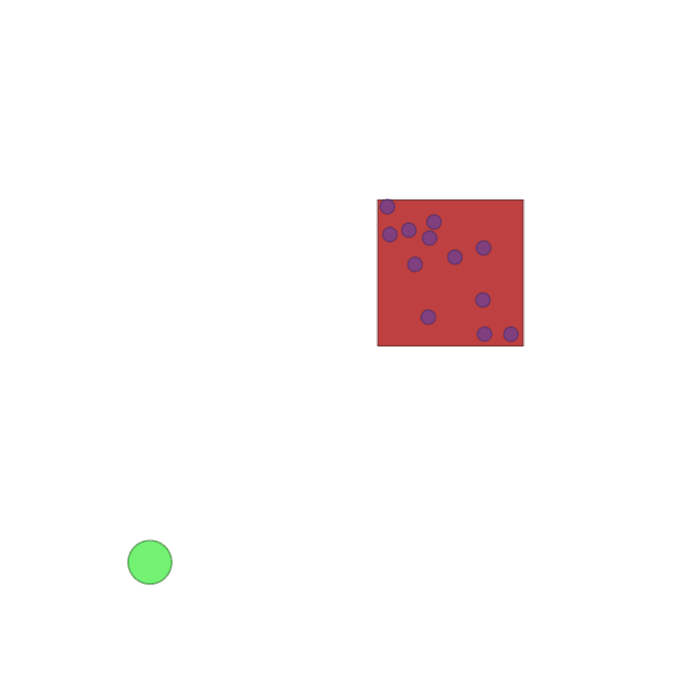 | 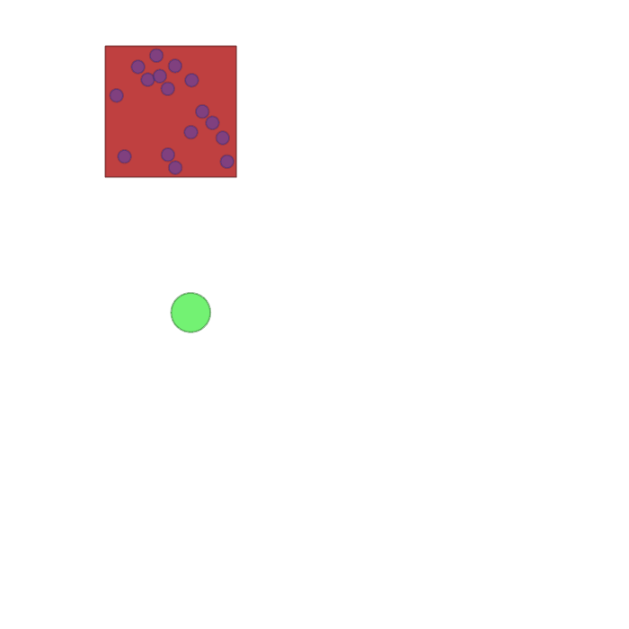 |  

### Sampling

|                     3 robots                      |                    5 robots                     |                    7 robots                     |                       9 robots                       |
|:-------------------------------------------------:|:-----------------------------------------------:|:-----------------------------------------------:|:----------------------------------------------------:|
|  |  |  |  |  

### Navigation

|                     4 robots                      |                    5 robots                     |                    6 robots                     |                       8 robots                       |
|:-------------------------------------------------:|:-----------------------------------------------:|:-----------------------------------------------:|:----------------------------------------------------:|
| 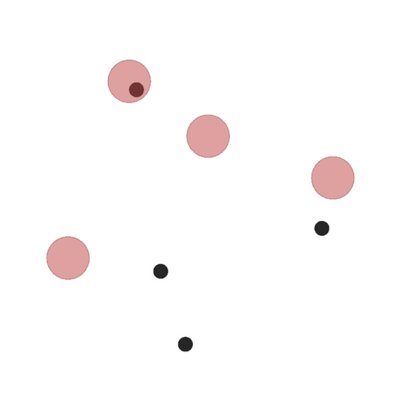 | 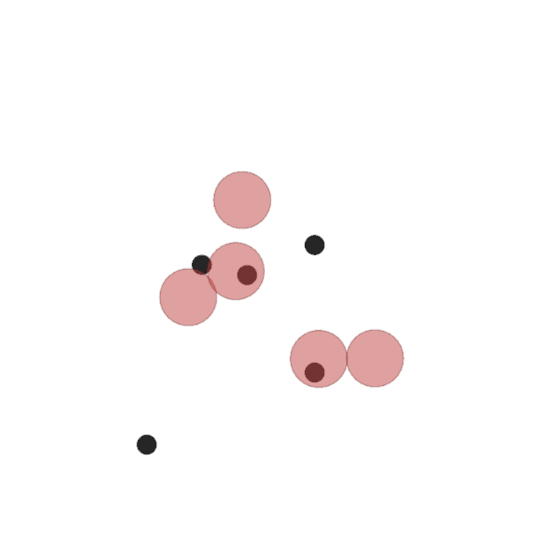 | 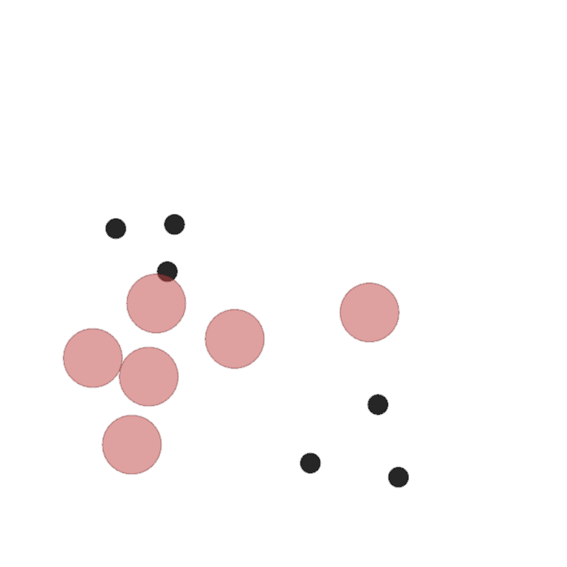 | 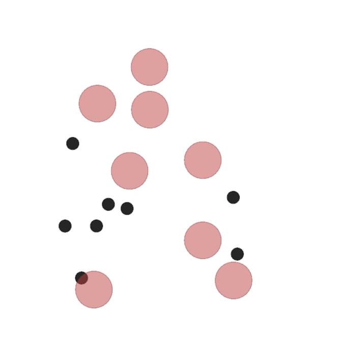 |  

### Food collection

|                     3 robots                      |                    6 robots                     |                    12 robots                    |                      24 robots                       |
|:-------------------------------------------------:|:-----------------------------------------------:|:-----------------------------------------------:|:----------------------------------------------------:|
| 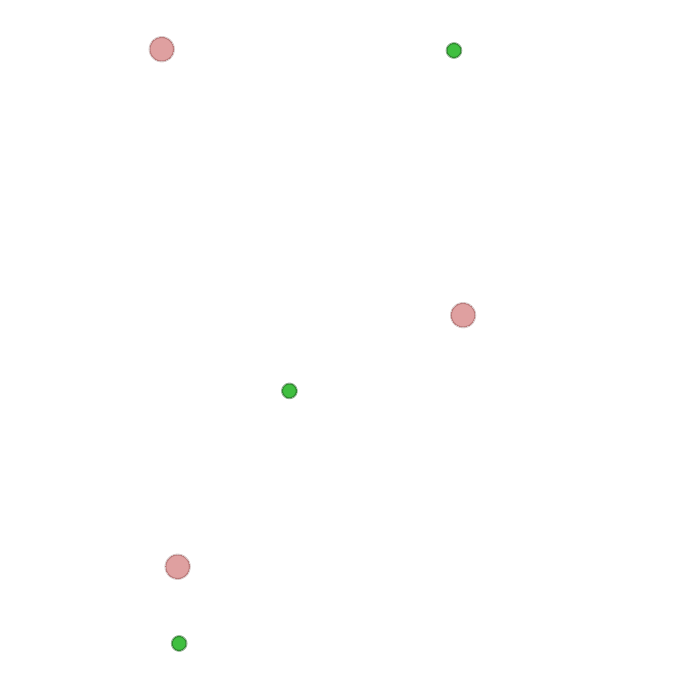 | 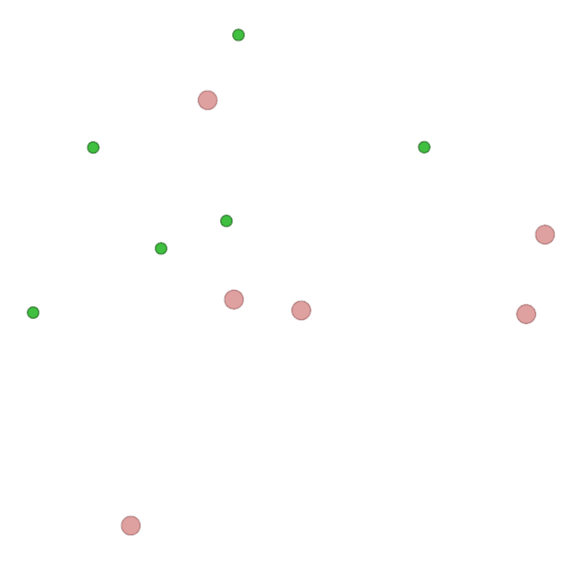 | 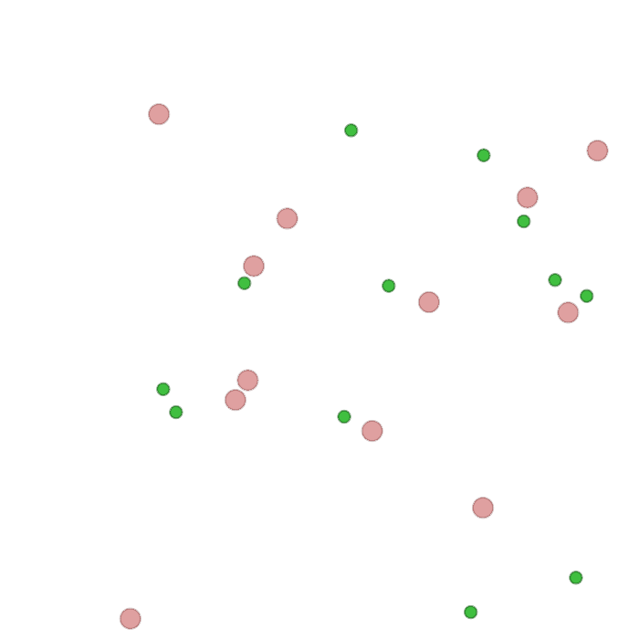 | 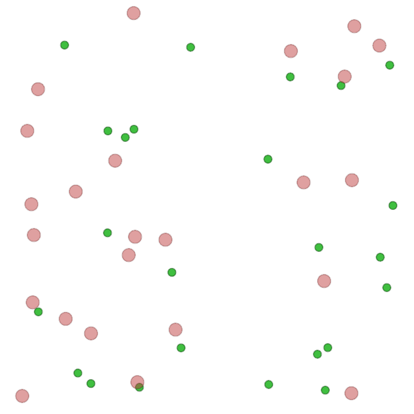 |  

### Grassland

|                     6 robots                      |                    12 robots                    |                    24 robots                    |                      48 robots                       |
|:-------------------------------------------------:|:-----------------------------------------------:|:-----------------------------------------------:|:----------------------------------------------------:|
| 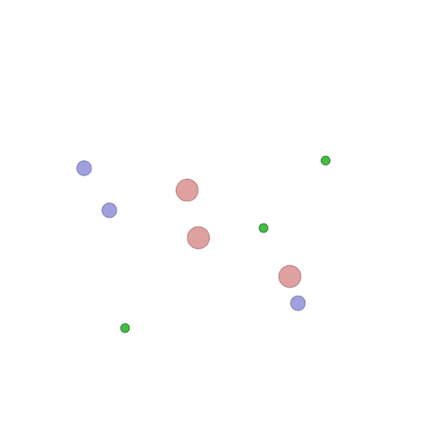 | 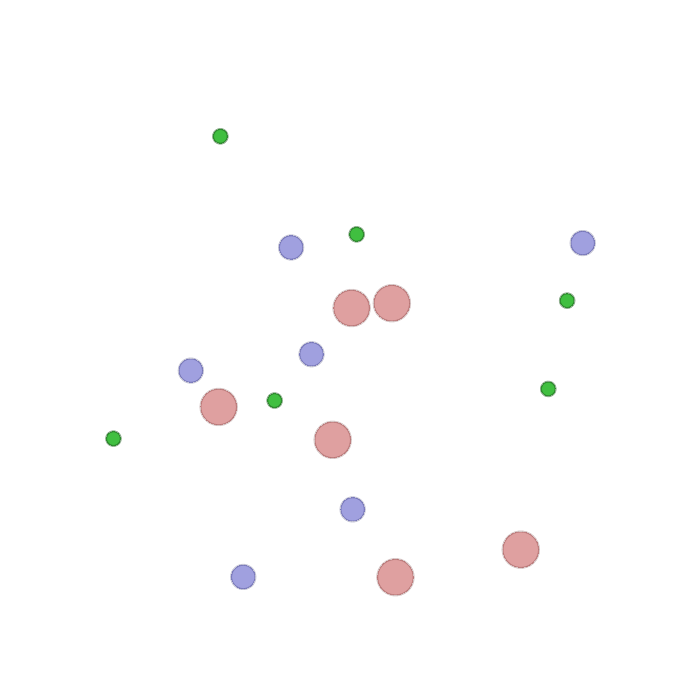 | 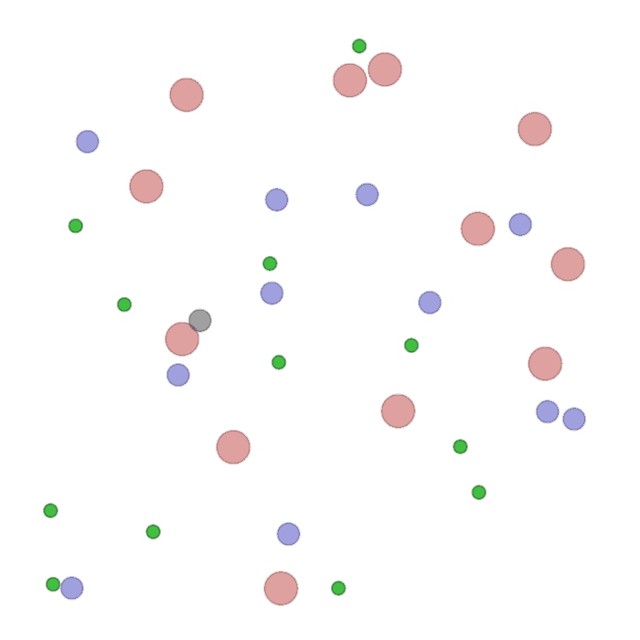 | 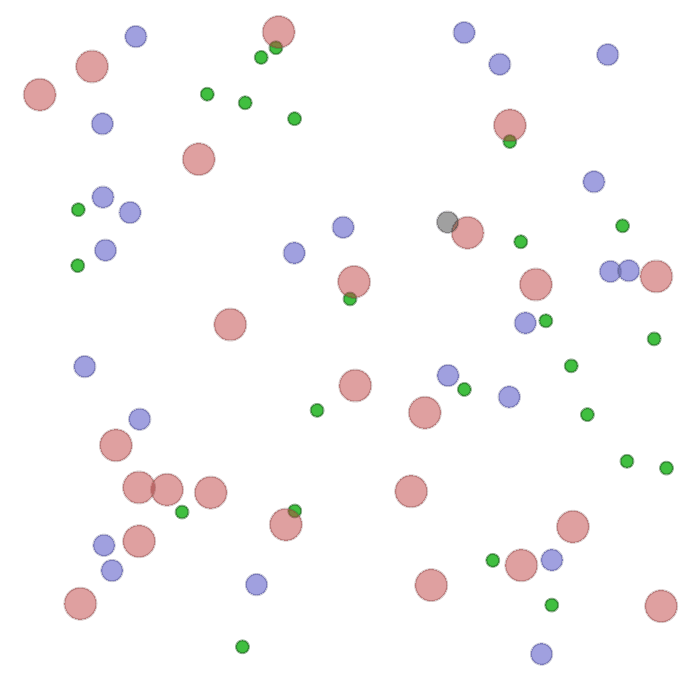 |  

### Adversarial

|                     6 robots                      |                    12 robots                    |                    24 robots                    |                      48 robots                       |
|:-------------------------------------------------:|:-----------------------------------------------:|:-----------------------------------------------:|:----------------------------------------------------:|
| 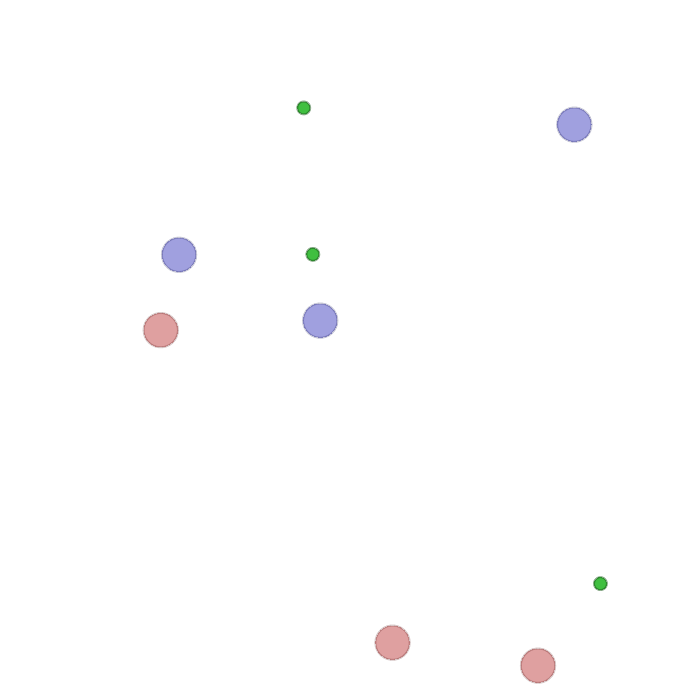 | 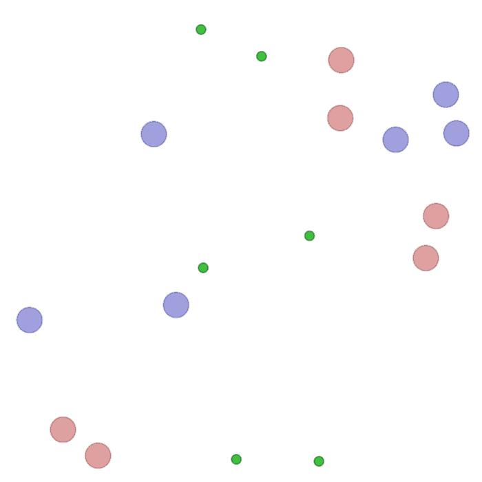 | 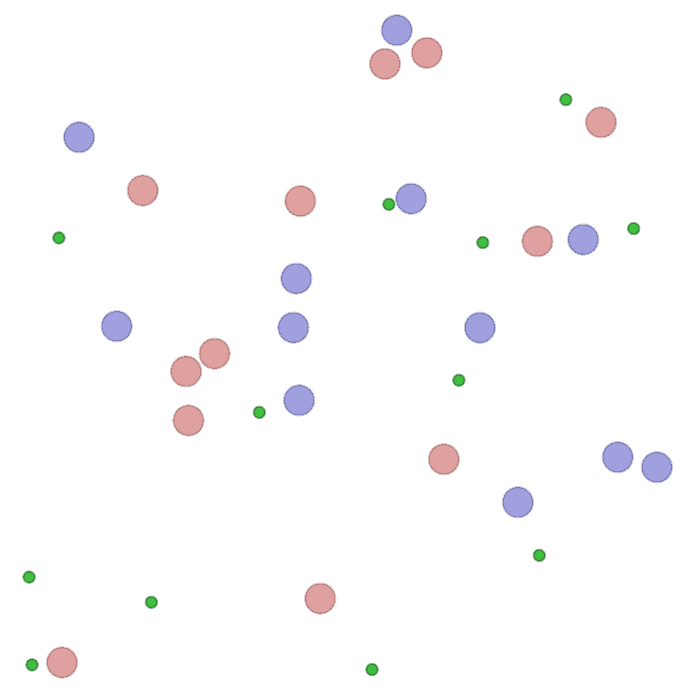 | 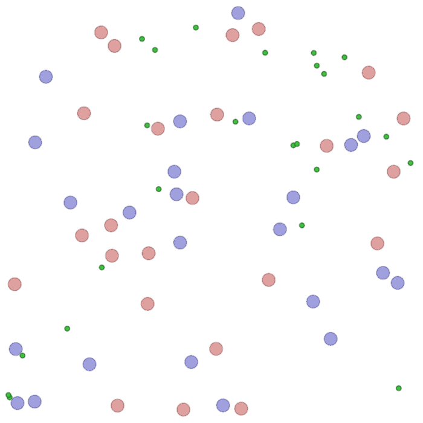 |  


## Code
The code is based on ```gym``` and makes use of some of the scenarios from [VMAS: Vectorized Multi-Agent Simulator](https://github.com/proroklab/VectorizedMultiAgentSimulator/tree/main). 
````sampling```` scenario is reimplemented to fit the version used in the paper. Besides, the 
scenarios with name ````food collection````, ```grassland``` and ```adversaries``` are implementations
of the scenarios used in the paper "[DARL1N: Distributed multi-Agent Reinforcement Learning with One-hop Neighbors](https://github.com/BaoqianWang/IROS22_DARL1N/tree/master)", but parallelized as in the ```vmas``` simulator.

The file ````instructions_scenarios```` includes instructions about how to modify [VMAS](https://github.com/proroklab/VectorizedMultiAgentSimulator/tree/main) to include 
the ````sampling````, ````food collection````, ```grassland``` and ```adversaries``` scenarios. 

We provide the weights of our policies for the different scenarios in the 
folder ````data/````.

You can train your own policies by executing ````python training.py````, tuning
the training parameters in the file ````parse_args.py````. You can run ````python evaluation.py````
to evaluate your trained policies and get some cool animations. The evaluation parameters can also be tuned
in the file ````parse_args.py````. 

You can train the policies for the Multi-Agent MuJoCo scenarios by executing the ````train_mujoco.sh```` file. To choose the port-Hamiltonian policy as the actor parameterization, go to ````mamujoco/algorithms/actor_critic```` and turn the
constructor parameter ````ph_MARL```` to ````True````.

## Citation
If you find our papers/code useful for your research, please cite our work as follows.

E. Sebastian, T. Duong, N. Atanasov, E. Montijano, C. Sagues. [Physics-Informed Multi-Agent Reinforcement Learning for Distributed Multi-Robot Problems](https://eduardosebastianrodriguez.github.io/phMARL/). Under review at IEEE T-RO, 2024

 ```bibtex
@article{sebastian24phMARL,
author = {Eduardo Sebasti\'{a}n AND Thai Duong AND Nikolay Atanasov AND Eduardo Montijano AND Carlos Sag\"{u}\'{e}s},
title = {{Physics-Informed Multi-Agent Reinforcement Learning for Distributed Multi-Robot Problems}},
journal = {arXiv preprint arXiv:2401.00212},
pages={1--14},
year = {2024}
}
```
